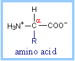

# DSSP File Format

## Resources
> Overall: http://swift.cmbi.ru.nl/gv/dssp/  
> Output: http://swift.cmbi.ru.nl/gv/dssp/DSSP_2.html  
> More: http://www.cmbi.ru.nl/dssp.html  
> Further: http://swift.cmbi.ru.nl/gv/dssp/HTML/descrip.html  

## General
The header part of each DSSP file is self explaining, it contains some of the information copied over from the PDB file and there are some statistics gathered while calculating the secondary structure.

The second half of the file contains the calculated secondary structure information per residue. What follows is a brief explanation for each column.

## Column Name Descriptions
###\#	
* The residue number as counted by DSSP

### RESIDUE	
* The residue number as specified by the PDB file followed by a chain identifier.

### AA	
* The one letter code for the amino acid. 
* If this letter is lower case this means this is a cysteine that form a sulfur bridge with the other amino acid in this column with the same lower case letter.

### STRUCTURE	
* This is a complex column containing multiple sub columns:
  * The first column contains a letter indicating the secondary structure assigned to this residue. Valid values are:
> 
| Code | Description |
|------|-------------|
| H    | Alpha Helix |
| B    | Beta Bridge |
| E    | Strand      |
| G    | Helix-3     |
| I    | Helix-5     |
| T    | Turn        |
| S    | Bend        |

  * What follows are three column indicating for each of the three helix types (3, 4 and 5) whether this residue is a candidate in forming this helix. 
    * A '>' character indicates it starts a helix 
    * A number indicates it is inside such a helix
    * a '<' character means it ends the helix.

  * The next column contains a S character if this residue is a possible bend.

  * Then there's a column indicating the chirality and this can either be positive or negative
    * i.e. the alpha torsion is either positive or negative.

  * The last two column contain beta bridge labels: 
    * Lower case here means parallel bridge
    * Upper case means anti parallel

### BP1 and BP2	
* The first and second bridge pair candidate, this is followed by a letter indicating the sheet.

### ACC	
* The accessibility of this residue, this is the surface area expressed in square Ångstrom that can be accessed by a water molecule.

### N-H-->O .. O-->H-N	
* Four columns, they give for each residue the H-bond energy with another residue where the current residue is either acceptor or donor. Each column contains two numbers:
  * The first is an offset from the current residue to the partner residue in this H-bond (in DSSP numbering)
  * The second number is the calculated energy for this H-bond

### TCO	
* The cosine of the angle between C=O of the current residue and C=O of previous residue. 
  * For alpha-helices, TCO is near +1
  * For beta-sheets TCO is near -1 
  * Not used for structure definition

### Kappa	
* The virtual bond angle (bend angle) defined by the three C-alpha atoms of the residues current - 2, current and current + 2. Used to define bend (structure code 'S').

### PHI and PSI	
* IUPAC peptide backbone torsion angles.

### X-CA, Y-CA and Z-CA	
* The Alpha Carbon coordinates
* 

## Example
> 
| # | RESIDUE | AA | STRUCTURE | BP1 | BP2 | ACC | N-H-->O  | O-->H-N  | N-H-->O | O-->H-N  | TCO    | KAPPA | ALPHA | PHI   | PSI   | X-CA  | Y-CA | Z-CA |
|---|---------|----|-----------|-----|-----|-----|----------|----------|---------|----------|--------|-------|-------|-------|-------|-------|------|------|
| 2 | 17      | V  | B 3 + A   | 182 | 0A  | 8   | 180,-2.5 | 180,-1.9 | 1,-0.2  | 134,-0.1 | -0.776 | 360.0 | 8.1   | -84.5 | 125.5 | -14.7 | 34.4 | 34.8 |
