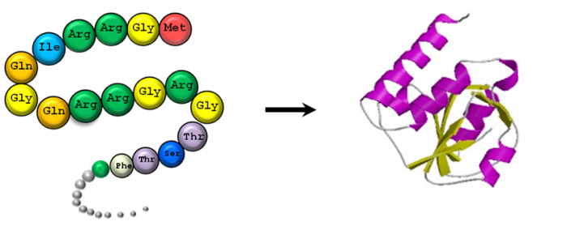

# Predicting Protein Fold State
### Lucas Ramadan

This is a project I undertook while completing my Masters' Degree in Data Science from galvanizeU. 

Goal
> Given a sequence of amino acids, can we predict the structure of the protein? For each amino acid, there is a corresponding "fold-state" which we would like to infer. 

I created a Neural Network for our Advanced Machine Learning course, which includes Convolutional and Recurrent Layers, including GRUs and LSTMs. Many different optimization methods, such as Momentum, Nesterov's, AdaGrad, AdaDelta, Adam and RMSProp were utilized, as well as tuning of hyper-parameters. Different activation functions, such as Sigmoid, Tanh, ELU, and ReLU, were implemented. Batch Normalization was used to mitigate the effect of vanishing and exploding gradients during training. 

I also created Probabilistic Graphical Models to compare, including a simple Naive Bayes model for benchmarking, a Hidden Markov Model (HMM) and soon, a Continuous Random Field (CRF). 

I intend to continue this project, and write my Capstone on the results!
